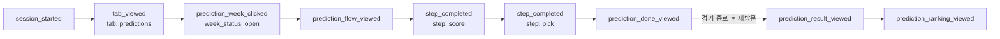

# 승부예측 Mixpanel 트래킹 계획

[[리텐션-개선-원페이저]]가 정의한 지표를 실제로 측정 가능하게 만드는 계획. 대상 기능은 [[승부예측-랭킹-요구사항-명세서]]의 승부예측·포지션별 픽·랭킹이다.

## 출발점 정정

"Mixpanel을 새로 붙인다"가 아니다. **Mixpanel은 이미 붙어 있고, 승부예측 기능만 트래킹이 0건**이다.

| 항목 | 상태 |
| --- | --- |
| `mixpanel-browser` 의존성 | 있음 (`^2.79.0`) |
| 클라이언트 유틸 | `frontend/src/lib/analytics/mixpanel.ts` — `trackEvent()`, `is_first_session` 자동 첨부 |
| 서버 유틸 | `frontend/src/lib/analytics/server.ts` — `trackServerEvent()`, 이미 `poll_first_vote_received`에서 사용 중 |
| 기존 이벤트 | `session_started`, `tab_viewed`, `return_visit`, `vote_submitted`, `pick_one_*` 등 약 18종 |
| 계약 테스트 | `frontend/src/lib/analytics/analytics-contract.test.mjs` — 이벤트명을 정규식으로 잠금 (리포 관례) |
| **승부예측 트래킹** | **`components/predict/**`·`lib/actions/predictions.ts`에 `trackEvent` 0건** |

따라서 과제는 기존 트래킹 체계의 **확장**이다.

## Phase 0 — 기반 갭 (구현 완료, 2026-08-23)

이벤트를 아무리 심어도 이 3건을 먼저 안 고치면 지표가 나오지 않는다.

### ① 유저 식별(identity) 부재 — 가장 치명적

`identify()` / `reset()` 호출이 코드베이스 전체에 0건이었다. 결과:

- 클라이언트 이벤트는 전부 **익명 디바이스 ID**로 쌓임 → 같은 사람이 폰·PC로 오면 2명으로 집계
- 반면 `trackServerEvent('poll_first_vote_received', poll.created_by, …)`는 **Supabase `user.id`**를 distinct_id로 씀 → **같은 사람이 서버 이벤트와 클라이언트 이벤트에서 다른 프로필로 갈라져 있었음**

원페이저의 핵심 지표가 "연속 2주 이상 참여율"(유저 단위 리텐션)인데 이 구조로는 계산이 불가능했다. 전체 표본이 75명이라 디바이스 중복 몇 건만으로 퍼센트가 크게 흔들린다 — 원페이저 "주의" 항목이 지적한 그 문제를 트래킹 구조가 증폭시키고 있던 셈.

**조치**: `lib/analytics/mixpanel.ts`에 `identifyUser(userId)` / `resetIdentity()` 추가. `AppAnalytics`에서 Supabase `onAuthStateChange`로 한 곳에서 바인딩.

- `onAuthStateChange`는 구독 직후 `INITIAL_SESSION`을 흘려주므로 **이미 로그인된 유저도 첫 렌더에서 식별**된다
- 로그아웃 버튼 2곳(`MenuLogoutButton`, `UserMenu`)과 OAuth 코드 교환이 **자동으로 커버**된다 — 개별 호출을 심을 필요 없음
- Mixpanel ID 병합이 익명 디바이스 ID를 식별된 ID로 흡수하므로 **앞으로의 데이터는 서버 이벤트와 자동으로 이어붙는다** (과거 데이터는 소급 안 됨)
- 가드 2개: 같은 유저 중복 `identify` 생략 / 비로그인 상태에서 `reset` 생략 (부르면 익명 ID가 매번 새로 발급되어 비로그인 퍼널이 끊긴다)

**구현 위치 판단 근거**: root `layout.tsx`는 서버 컴포넌트지만 유저를 가져오지 않는다(각 페이지가 `auth` prop을 개별 fetch). layout에 auth fetch를 넣으면 전 라우트가 dynamic 렌더링으로 바뀌는 대가가 있어서, 클라이언트에서 세션을 읽는 방식을 택했다. 빌드 결과 `/`·`/players`·`/polls`의 정적 렌더링이 그대로 유지됨을 확인.

### ② `getSourcePage()`에 `/predictions` 누락

`polls`/`players`/`my`/`menu`는 다 있는데 predictions만 빠져서, 예측 화면에서 나가는 모든 이벤트의 `source_page`가 `'direct'`로 떨어지고 있었다.

**조치**: 기존 `polls` / `poll_detail` 분리 방식을 따라 두 값으로 추가.

| 라우트 | `source_page` |
| --- | --- |
| `/predictions` | `predictions` |
| `/predictions/[weekKey]` | `prediction_week` |

`prediction_detail`이 아니라 `prediction_week`으로 한 이유 — 코드가 도메인 언어로 "week"를 일관되게 쓴다(`weekKey`, `findWeekSession`, `week_leaderboard`). 표면적 대칭보다 도메인 일치를 택했다.

### ③ `getPrimaryTab()`에 `/predictions` 누락

`'poll' | 'players' | 'menu'` 3개만 반환했다. BottomNav에 '예측' 탭이 엄연히 있는데(`BottomNav.tsx`) `tab_viewed`가 안 나갔다 → **예측 퍼널의 최상단이 통째로 비어 있었음.**

**조치**: `'predictions'` 추가. 기존 `'poll'`(단수)과 어긋나지만, 라우트 정렬 명명이 데이터를 읽는 사람에게 더 예측 가능하므로 기존 불일치를 전파하지 않는 쪽으로 결정.

### 검증

`analytics-contract.test.mjs`에 계약 4건 추가(리포 관례). 전체 118개 테스트 통과, lint·build 통과.

## 원페이저 지표 → 필요한 이벤트

| 원페이저 지표 | 목표 | 필요한 것 |
| --- | --- | --- |
| **연속 2주 이상 참여율** (핵심) | 10% 이상 | `prediction_submitted` + `week_key` + **Phase 0 ①identity** |
| WAU 중 예측 참여 비율 | 45% 이상 | 분자 `prediction_submitted` distinct user / 분모 `session_started` distinct user, 둘 다 주간 버킷 |
| 경기 있는 주 vs 없는 주 접속 격차 | 1.5배 이상 | `session_started`에 `week_key` 추가 + 분석 시점에 경기 캘린더 조인 |
| 주당 신규 투표 공급 수 / 재방문 시 신규 콘텐츠 노출 비율 | — | **범위 밖** (원인2=서브, FR-010·011 미확정 + AI API 비용 이슈) |

### `week_key`를 명시적으로 박는 이유

`lib/predictions/week.ts`의 `weekKey(kst: Date)`는 **fixture 데이터가 필요 없는 순수 함수**(`'2026-35'` ISO 주차 형식)로, 클라이언트에서 `weekKey(new Date())`로 바로 계산할 수 있고 DB `week_leaderboard.week_key`와 형식이 일치한다.

Mixpanel 자체 주간 버킷팅은 프로젝트 타임존/UTC 기준이라 앱의 KST ISO 주차 정의와 어긋난다. 주간 지표가 전부 이 키에 걸려 있으므로 프로퍼티로 직접 박아야 한다.

### "경기 있는 주" 라벨링 방법

세션은 `/predictions`를 방문하지 않아도 발생하므로, "이 주에 경기가 있었나"는 클라이언트에서 알 수 없다(fixture fetch를 전 라우트에 추가하는 비용은 과함). **`week_key`만 이벤트에 심고, 경기 캘린더 조인은 분석 시점에 처리**한다 — 시즌당 약 38주라 수동 관리나 Mixpanel Lookup Table로 충분하다.

## 이벤트 명세 (신규 12 + 기존 확장 1)

전부 `prediction_` 프리픽스로 통일한다.

> **명명 주의**: 선수 페이지 기능으로 `pick_one_*`이 이미 존재해서 "픽"이 용어 충돌한다. 프리픽스로 반드시 구분할 것.

공통 프로퍼티: `source_page`, `week_key` (+ `is_first_session` 자동)

### Phase 1 — 핵심 지표용

| 이벤트 | 실행 | 발생 시점 | 고유 프로퍼티 |
| --- | --- | --- | --- |
| `prediction_submitted` | **서버** | `submitWeekPrediction` 성공 | `match_count`, `submittable_match_count`, `is_partial` |
| `prediction_result_viewed` | 클라 | `PredictionResult` 마운트 | `participated`, `rank`, `total_points`, `total_entries` |
| `session_started` *(확장)* | 클라 | 기존 그대로 | **`week_key` 추가** |

### Phase 2 — 퍼널 진단용

| 이벤트 | 실행 | 발생 시점 | 고유 프로퍼티 |
| --- | --- | --- | --- |
| `prediction_week_clicked` | 클라 | `PredictListClient` `onSelectWeek` | `week_status`, `cta`, `has_pending`, `submitted`, `match_count` |
| `prediction_flow_viewed` | 클라 | `PredictionFlowClient` 마운트 | `pending_match_count`, `total_match_count`, `is_partial` |
| `prediction_step_completed` | 클라 | `score→pick`, `pick→confirm` 전환 | `step`, `match_count`, `is_multi`, + score: `untouched_score_count` / pick: `used_copy_picks` |
| `prediction_done_viewed` | 클라 | `PredictionDone` 마운트 | `submitted_match_count`, `missed_match_count` |
| `prediction_auth_required` | 클라 | `unauthenticated` 분기 | — |
| `prediction_submit_failed` | 클라 | 그 외 에러 분기 | `error` (8종 — `unauthenticated`는 `auth_required`로 빠지므로 제외) |

**구현 중 바뀐 것 2건** (계획 → 실제):

- **`cta` → `destination` + 판정 근거 raw 필드**. 처음엔 `MatchWeekList`의 CTA 문구(`예측하기` / `남은 경기 예측하기` / `제출완료` / `결과보기`)를 그대로 쓸 생각이었지만, 그러면 UI 문구를 고칠 때 이벤트가 조용히 어긋난다. `week_status` · `submitted` · `has_pending`를 그대로 실어보내고 `destination`(flow·done·result)만 파생시킨다 — 세 필드가 CTA를 완전히 결정하므로 분석 쪽에서 언제든 재구성할 수 있다.
- **`filled_match_count` → `untouched_score_count`**. `scores`가 모든 경기에 `[0,0]`으로 초기화되어 **"미입력" 상태가 존재하지 않는다**(0-0도 유효한 예측이다). 대신 0-0을 그대로 넘긴 경기 수를 세서, 스테퍼를 아예 만지지 않고 통과하는 비율을 본다.

스코어 +/− 클릭마다 이벤트를 심으면 노이즈라, 스텝 전환 시 스냅샷으로 남긴다.

### Phase 3 — 체감가치 · 밸런싱용

| 이벤트 | 실행 | 발생 시점 | 고유 프로퍼티 |
| --- | --- | --- | --- |
| `prediction_pick_selected` | 클라 | `PlayerPickModal` `onSelect` 호출부 | `fixture_id`, `position`, `player_id`, `multiplier` |
| `prediction_ranking_viewed` | 클라 | 결과 탭 / 데스크탑 섹션 | `scope`(week·season), `surface`, `my_rank` |
| `prediction_ranking_expanded` | 클라 | `WeekRankCard` "전체보기" | `total_entries` |
| `prediction_shared` | 클라 | `ShareButton` (`source` prop 추가 필요) | `surface`(done·result) |

데스크탑 랭킹은 두 섹션이 항상 노출되어 클릭으로 못 잡는다. `surface: 'result_tab' | 'desktop_section'`으로 구분해 "의도적 조회"와 "자동 노출"이 분석에서 섞이지 않게 한다.

## 추적 방식 — 결정 3가지

### ① 제출은 "서버 이벤트", 퍼널 종료는 "클라 이벤트"로 역할 분리

단순 하이브리드(제출만 서버)로 두면 퍼널 마지막 단계만 서버 이벤트가 되어, **애드블록 유저가 앞 단계 없이 마지막 단계만 찍히는** 이상한 퍼널이 생긴다. 그래서 둘의 역할을 분리한다:

- **`prediction_submitted` (서버)** = 지표용. 애드블록에 안 막히고 `user.id`가 정확한 distinct_id → 리텐션·WAU 계산의 authoritative source
- **`prediction_done_viewed` (클라)** = 퍼널 종료용. 제출 성공 시 `router.refresh()`로 `PredictionDone`이 마운트되므로 사실상 제출 성공과 1:1

두 이벤트는 같은 성공 1회에서 나오지만 **측정 대상이 달라 중복 집계가 아니다.** 퍼널은 전부 클라이언트로 일관되고, 지표는 서버로 정확해진다.

### ② 중복 제거(dedup) 하지 않음

Mixpanel 퍼널은 기본이 **unique user 집계**라 이벤트가 여러 번 찍혀도 전환율이 왜곡되지 않는다. 오히려 결과 화면을 여러 번 보러 온 것 자체가 신호다 — **재방문이 이 프로젝트 가설의 본체**다. 마운트 이벤트에 sessionStorage 가드를 걸면 그 신호를 버린다.

(dev에서 React StrictMode 이중 마운트로 2배로 보이지만 프로덕션 영향은 없다.)

### ③ `week_key` 계산 — 헬퍼를 export해서 처리 ⚠️

`weekKey(kst: Date)`는 이름 그대로 **+9h 시프트된 Date**를 기대한다(`week.ts`의 private `toKst()`가 그렇게 만들어 넘김). 클라이언트에서 무심코 `weekKey(new Date())`를 부르면 UTC 달력 기준으로 계산되어 **KST 00:00~09:00 구간이 전날로 밀리고, 월요일 오전엔 지난 주차로 잡힌다.** 주간 지표 전체가 조용히 어긋나는 종류의 버그다.

호출부마다 `+9h`를 직접 더하게 하면 언젠가 누가 빠뜨리므로, `week.ts`에 헬퍼를 추가하고 `week.test.mjs`로 경계값을 잠갔다:

```ts
/** 지금 시각이 속한 ISO 주차 키. 트래킹·집계에서 '이번 주'를 판정할 때 쓴다. */
export function currentWeekKey(now: Date = new Date()): string {
  return weekKey(new Date(now.getTime() + KST_OFFSET_MS))
}
```

**추정이 아니라 실측으로 확인됨** — 2026-08-24(월) 00:30 KST(= 08-23 15:30 UTC)에서 `currentWeekKey()`는 `'2026-35'`, `weekKey()`는 `'2026-34'`를 반환한다. 테스트가 두 값을 나란히 assert해서 이 차이가 사라지면 실패한다.

## 볼 퍼널



### 퍼널 A — 주간 예측 참여 (진입 → 제출)

`session_started` → `tab_viewed{tab:predictions}` → `prediction_week_clicked{week_status:open}` → `prediction_flow_viewed` → `prediction_step_completed{step:score}` → `prediction_step_completed{step:pick}` → `prediction_done_viewed`

**답하는 질문**: 예측을 시작한 사람이 끝까지 제출하는가, 어디서 포기하는가.

**가장 주목할 구간**: `step:score` → `step:pick`. 픽 단계는 **포지션 3개 × 그 주 경기 수를 전부 채워야** `confirm`으로 넘어갈 수 있는 구조(`allPicked` 게이트)라 구조적으로 가장 무겁다. 여기 이탈률이 높으면 FR-003의 "포지션별 1명"이라는 라이트한 의도와 실제 부담이 어긋난다는 증거가 된다.

### 퍼널 B — 재방문 트리거 (제출 → 결과 확인) ★ 가설의 핵심

`prediction_submitted{week_key:W}` → [경기 종료] → `session_started` → `prediction_result_viewed{week_key:W, participated:true}` → `prediction_ranking_viewed{week_key:W}`

**답하는 질문**: 원페이저의 핵심 주장 — "뉴캐슬 경기 일정 자체가 다시 와서 결과를 확인할 캘린더 역할을 한다" — 이 실제로 작동하는가.

**1단계 → 4단계 전환율이 이 프로젝트 전체에서 가장 중요한 숫자다.** 제출은 하는데 결과를 보러 안 오면 리텐션 가설 자체가 틀린 것이다.

주의: Mixpanel에서 **`week_key`로 묶어야** 한다(W주 제출자가 **W주** 결과를 봤는지). 안 묶으면 다른 주 결과를 본 것까지 전환으로 센다. 추가로 "경기 종료 → 결과 확인까지 걸린 시간" 분포를 보면, 재방문이 경기 직후에 몰리는지(트리거 작동) 산발적인지(원래 오던 사람) 갈라볼 수 있다.

### 퍼널 C — 로그인 벽 (비로그인 이탈)

`prediction_flow_viewed` → `prediction_step_completed{step:pick}` → `prediction_auth_required` → `login_completed` → `prediction_done_viewed`

**답하는 질문**: 비로그인 유저가 **3스텝을 다 채우고 나서야** 로그인 벽을 만나는 구조가 실제로 얼마나 유저를 잃는가.

클라이언트가 로그인 여부를 미리 모르고 제출 시점에야 `unauthenticated`를 받는 구조 때문이다. `prediction_auth_required` → `login_completed` 전환율이 낮으면 개선안은 명확하다 — 로그인 요구 시점을 플로우 앞쪽으로 당기기.

### 리텐션 리포트 — 연속 주 참여 (퍼널 아님)

핵심 지표 "연속 2주 이상 참여율"은 퍼널이 아니라 Mixpanel **Retention 리포트**로 본다.

- 기준 이벤트 `prediction_submitted` → 리턴 이벤트 `prediction_submitted`, 단위 = 주
- Mixpanel 기본 주간 버킷은 프로젝트 타임존 기준이라 앱의 KST ISO 주차와 어긋날 수 있음 → **`week_key` 프로퍼티로 검산**

### 브레이크다운 — 마찰 진단 (퍼널 아님)

`prediction_submit_failed`를 `error`별로 쪼갠다. 실리는 코드는 **8종**이다 — `SubmitPredictionResult`의 유니온은 9종이지만 `unauthenticated`는 `handleSubmit`에서 먼저 걸러져 `prediction_auth_required`로 빠진다.

성격이 4가지로 갈리고, 그룹마다 "나왔을 때 할 일"이 다르다.

| 그룹 | `error` | 시사점 |
| --- | --- | --- |
| **A. 진짜 UX 마찰** | `closed` | 마감(= 그 주 마지막 경기 킥오프)을 입력 중에 넘김. **유일하게 정상적으로도 발생하는 코드** → 남은 시간 표시·마감 임박 경고로 개선 |
| **B. 클라이언트 갭** | `invalid_score` | 스코어 상한 가드가 없어 `+`를 21번 누르면 도달 가능 (아래 참고) |
| | `already_submitted` | 탭 2개 / 뒤로가기 / revalidate 반영 전 재시도. 잦으면 제출 상태가 화면에 안 드러남 |
| | `duplicate_picks` | 사용자 잘못이 아닐 가능성 — 같은 선수가 두 포지션 후보에 동시에 들어있다는 뜻(`season_squads` 분류 문제) |
| **C. 수용된 리스크 발현** | `incomplete` | 정상 경로로는 불가(스코어 0-0 초기화 + `allPicked` 게이트). **킥오프 연기로 잠긴 경기가 되살아난 경우**뿐 — FR-013이 "수용된 리스크"로 남긴 그 케이스다 |
| **D. 운영 장애** | `setup_required` | 스키마 미적용 = 배포 사고 |
| | `unknown_player` | 선수단 변경 또는 페이지·액션 간 캐시 스큐 |
| | `failed` | 캐치올. 주차 못 찾음(낡은 페이지)도 섞임 — **이벤트만으로 원인 특정 불가, 서버 로그 병행 필요** |

표본이 작으니 어떤 코드든 2~3건 이상이면 조사 대상. 단 `incomplete` · `duplicate_picks` · `setup_required`는 **정상 경로로 나올 수 없는 코드라 1건만 나와도** 봐야 한다.

`closed`는 발생 경로가 셋(주차 status / 남은 경기 0 / RLS `42501`)인데 이벤트로 구분되지 않는다. 특히 RLS로 걸린 경우는 "액션이 읽은 fixture 데이터가 낡았다"는 다른 성격이라, 자주 나오면 구분자를 추가할 가치가 있다.

코드별 발생 위치·조건과 도달 가능성은 [[#부록 prediction_submit_failed 에러 코드 8종]] 참고.

### 해결됨: 스코어 상한 가드 부재 (2026-08-24)

`ScoreStepper`의 두 버튼이 비대칭이었다 — `−`는 `disabled={value <= 0}`인데 `+`에는 가드가 없고, `changeScore`도 `Math.max(0, …)`로 하한만 클램프했다. 서버만 `MAX_SCORE = 20`으로 막아서 **`+`를 21번 누르면 서버 왕복 후에야 `invalid_score`를 보는** 상태였다(하한 두 겹, 상한 0겹).

조치 — 상한도 같은 두 겹으로 맞추고 화면 안전망을 더했다:

1. `changeScore`가 `Math.min(MAX_SCORE, Math.max(0, …))`로 양쪽 클램프
2. `+` 버튼에 `disabled={value >= MAX_SCORE}` (`−`와 대칭)
3. **`scoreRangeError` 안전망** — 위 둘을 뚫고 범위 밖 값이 들어와도 그 자리에서 오류를 띄우고 넘어가기·제출을 잠근다. 서버 왕복 없이 사용자가 바로 안다
4. `MAX_SCORE`를 `submit.ts`에서 import — 클라이언트가 20을 하드코딩하지 않고 **서버 검증과 같은 상수를 공유**한다

회귀 방지: `components/predict/score-input.test.mjs` (3건). `value >= 20` 하드코딩이 다시 들어오면 실패한다.

## 구현 순서

| Phase | 내용 | 왜 이 순서인가 | 상태 |
| --- | --- | --- | --- |
| 0. 기반 | identity + `getSourcePage` + `getPrimaryTab` | 이거 없으면 아래 전부 오귀속. diff는 작고 레버리지 최대 | **완료** |
| 1. 핵심 지표 | `currentWeekKey()` + `prediction_submitted`(서버) + `prediction_result_viewed` + 앱 이벤트에 `week_key` | 원페이저 지표 3개를 이 단계에서 전부 계산 가능 | **완료** |
| 2. 퍼널 진단 | `week_clicked`, `flow_viewed`, `step_completed`, `done_viewed`, `auth_required`, `submit_failed` | **어디서** 깨지는지 → 사용성 테스트 1단계와 교차 검증 | **완료** |
| 3. 심화 | `pick_selected`, `ranking_*`, `shared` | 배당 밸런싱(CST-003) 판단 데이터 확보 | 미착수 |

각 Phase마다 `analytics-contract.test.mjs`에 이벤트명 등록.

## 트래킹이 미결 스펙을 방어한다 (부수 효과)

명세서 **CST-006(부분 참여자 집계 방식 미확정)**은 "이미 구현이 돌고 있어서 방치 비용이 있다"고 스스로 적어둔 항목이다.

`prediction_submitted`에 **`submitted_match_count` / `submittable_match_count` / `is_partial`**을 처음부터 박아두면, 나중에 ①집계 제외 단위 ②정규화 여부(합계 vs 경기당 평균) 중 무엇으로 결정하든 **쌓인 데이터를 소급 재분석할 수 있다.** 결정을 미루는 비용을 트래킹이 상당 부분 흡수한다.

## 결정 기록

| 항목 | 결론 | 날짜 |
| --- | --- | --- |
| `prediction_submitted`를 서버로 보낼지 | **역할 분리로 해소** — 지표는 서버(`prediction_submitted`), 퍼널 종료는 클라(`prediction_done_viewed`). 단순 하이브리드의 "퍼널 마지막 단계만 서버" 문제를 피한다 (추적 방식 ①) | 2026-08-23 |
| 프로덕션 Mixpanel 토큰 | **설정 확인됨** (사용자 확인) | 2026-08-23 |
| 마운트 이벤트 dedup | **하지 않음** — Mixpanel unique user 집계로 충분하고, 재방문 신호를 버리지 않기 위해 (추적 방식 ②) | 2026-08-23 |
| `week_key` 계산 | `week.ts`에 `currentWeekKey()` export + 경계값 테스트 (추적 방식 ③) | 2026-08-23 |

## 남은 미확정

1. **용어 불일치** — 명세서는 "MVP 픽", 코드는 포지션별 3픽(DEF/MID/FWD)이고 `candidates.ts`에 MVP 개념이 없다. 이벤트명은 코드 기준으로 가고, 명세서 쪽을 추적성 규칙(0장 변경 이력)으로 정리하는 것이 맞아 보인다.

## 부록: `prediction_submit_failed` 에러 코드 8종

`SubmitPredictionResult`의 에러 유니온은 9종이지만, `unauthenticated`는 `handleSubmit`에서 먼저 걸러져 `prediction_auth_required`로 빠진다. 그래서 이 이벤트의 `error`에 실리는 값은 **8종**이다.

"나왔을 때 무슨 뜻인가"는 위 [[#브레이크다운 마찰 진단 퍼널 아님]]의 4분류 표에 있고, 여기서는 **어디서 어떤 조건으로 발생하는가**를 정리한다.

### 발생 위치

| 코드 | 발생 위치 | 조건 |
| --- | --- | --- |
| `closed` | `submit.ts` `buildPredictionRows` | 주차 status가 `open`이 아님 |
| | 같은 함수 | 잠기지 않은 경기가 0개 (전부 킥오프 지남) |
| | `predictions.ts` insert 후 | PG `42501` — RLS 정책이 거부(서버 시각 기준 이미 닫힘) |
| `incomplete` | `submit.ts` `buildPredictionRows` | 제출 대상 경기의 **스코어 누락** |
| | `submit.ts` `resolvePicks` | 제출 대상 경기의 **픽 누락**(포지션 3개 중 하나라도 없음) |
| `invalid_score` | `submit.ts` `buildPredictionRows` | 스코어가 0~`MAX_SCORE`(20) 정수 범위 밖 |
| `duplicate_picks` | `submit.ts` `resolvePicks` | 한 경기 안에서 두 포지션에 같은 선수 (DB `predictions_distinct_picks`와 같은 규칙) |
| `unknown_player` | `submit.ts` `resolvePicks` | 서버 후보 목록에 없는 player id |
| `already_submitted` | `predictions.ts` insert 후 | PG `23505` — `predictions_one_per_user_fixture` 유니크 위반 |
| `setup_required` | `predictions.ts` insert 후 | `predictions` 스키마 미적용(`supabase db push` 안 됨) |
| `failed` | `predictions.ts` 진입부 | `findWeekSession`이 null — 낡은 페이지의 weekKey가 fixture 창을 벗어남 |
| | `predictions.ts` insert 후 | 위 어디에도 안 걸린 insert 오류 (`console.error`로 서버 로그에 남음) |

### 정상 경로로 도달 가능한가

이 구분이 실무적으로 가장 중요하다 — **도달 불가인 코드가 뜨면 UX 문제가 아니라 버그·장애·데이터 문제다.**

| 코드 | 도달 가능성 | 근거 |
| --- | --- | --- |
| `closed` | **가능 (정상)** | 마감이 그 주 마지막 경기 킥오프이라, 입력 중에 넘기면 걸린다. 8종 중 유일하게 정상 마찰 |
| `already_submitted` | 조건부 | 한 탭 안에서는 `submitting` 가드 + 완료 화면 고정으로 막힘. 탭 2개·뒤로가기·revalidate 반영 전 재시도로만 |
| `invalid_score` | **불가 (2026-08-24 이후)** | 상한 가드·클램프·화면 안전망 3중으로 막았다. 그 전에는 `+` 21번으로 도달 가능했음 |
| `incomplete` | **불가 — 한 예외** | 스코어는 `[0,0]` 초기화, 픽은 `allPicked` 게이트. 서버 대상 경기는 클라이언트 `pending`의 부분집합이어야 한다(잠금은 단방향). **킥오프 연기로 잠긴 경기가 되살아난 경우만** 뚫린다 |
| `duplicate_picks` | **불가** | 모달이 포지션별 후보만 보여준다. 뜬다면 같은 선수가 두 포지션 후보에 동시에 있다는 뜻 → `season_squads` 분류 데이터 문제 |
| `unknown_player` | **불가** | 선수단이 세션 중 변경되거나 페이지·액션 간 캐시 스큐일 때만 |
| `setup_required` | **불가** | 프로덕션에 뜨면 배포 사고 |
| `failed` | **불가** | 캐치올. 이벤트만으로 원인 특정 불가 — 서버 로그 병행 필요 |

### `incomplete`가 특별한 이유

`incomplete`는 정상 경로로 나올 수 없는데, **딱 하나 뚫리는 경로가 명세서가 의도적으로 남긴 리스크와 정확히 겹친다.**

FR-013 비고: *"경기 취소·연기 자체에 대한 별도 처리 로직은 만들지 않고 제출 창을 좁게 여는 방식으로 리스크를 줄이기로 함(**수용된 리스크**)"*

킥오프가 뒤로 밀리면 잠겨 있던 경기가 서버 제출 대상에 되살아나는데, 클라이언트에는 그 경기의 스코어·픽이 없어서 `incomplete`가 난다. 즉 **`incomplete` 발생 = 수용한 리스크가 실제로 터진 순간**이다. 트래킹이 이 리스크의 감시자 역할을 하게 된다 — 자주 터지면 "수용"을 재검토해야 한다는 신호다.

## Related

- 원페이저: [[리텐션-개선-원페이저]]
- 요구사항 명세서: [[승부예측-랭킹-요구사항-명세서]]
- 사용성 테스트: [[사용성-테스트-프로토콜]]
